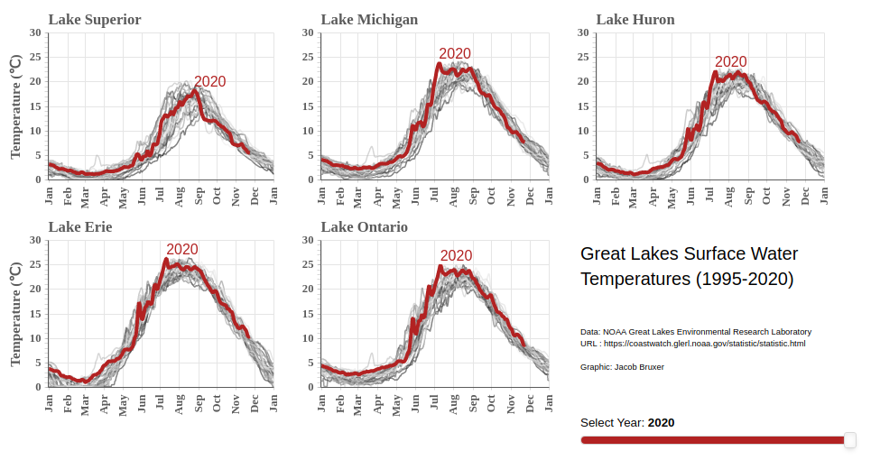

# Great Lakes Surface Temperatures

This is a Bokeh application to view Great Lakes daily surface temperatures from NOAA's Great Lakes Environmental Research Laboratory.

## Instructions

The app is run from the command line using the following:

    bokeh serve --show main.py

## Live Version

(*no longer functions*)

A live version of this application can be launched with binder:

Static image of the application:

